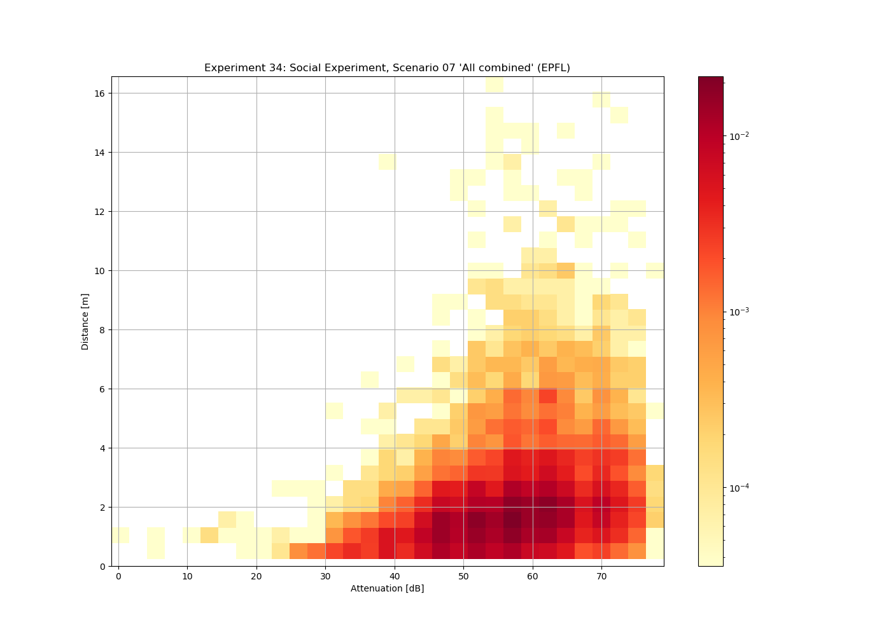
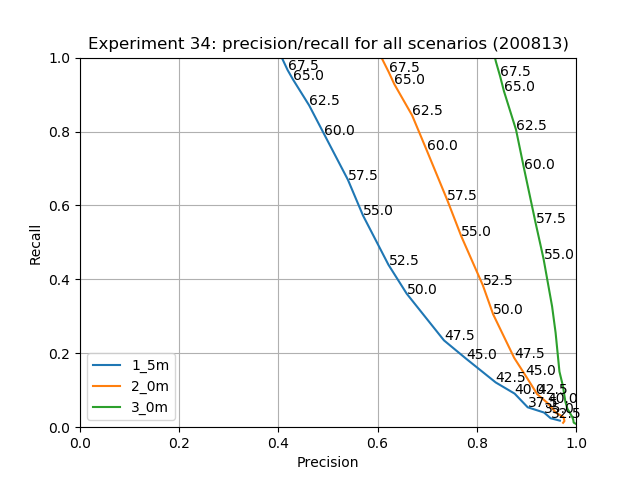
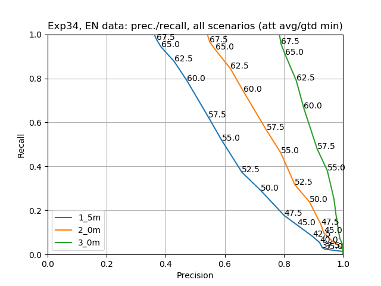

# BLE measurements

## Disclaimer

> We provide access to the raw data of our BLE experiments. The data was
> collected in laboratory conditions between a fixed set of phone models
> (for the majority of experiments). We do not claim that these experiments
> are representative of all possible situations that can arise in reality.
> They serve as an indication and exploration of different design parameters.

## Introduction and scope

Contact tracing requires that exposure (proximity over time) to an infectious
subject is measured. Digital contact tracing mechanisms such as DP-3T and GAEN
estimate such exposure based on attenuation of BLE signals emitted from two
phones.  We have to anticipate a large amount of heterogeneity between any two
phones:

* Different Bluetooth chips/capabilities (e.g., some phones only transmit at
  max power);
* Different relative locations (e.g., at ear, outside, on table, in front
  pocket, in back pocket, in backpack, in purse, in jacket);
* Different obstructions (e.g., people or objects blocking line of sight)

The proximity estimation must take into consideration all these different
parameters. Our experiments create a baseline of this parameter space for
different phones to estimate proximity together along with an error estimate.
We design two sets of experiments: first, laboratory experiments to infer
baseline proximity parameters; second, social experiments to test the inferred
baseline in a practical setting. The laboratory experiments serve to test
individual single aspects through precise measurements and the social
experiments test end to end parameters. For both types of experiments we have
exact ground truth data to evaluate the precision of our estimation.

The stationary laboratory experiments simulate different static configurations
at distances between 1m and 45m.

Here we give a short overview of our dynamic social experiments used to derive
basic parameters. We evaluate the following scenarios: 

* Lunch environment (with two groups having lunch)
* Train environment (people traveling together in the train)
* Office environment (people interacting in open space setting)
* Queuing at a store (1 or 2 lines with cashiers)
* Free movement of people in crowded space ("party")
* Rapid movement of people similar to a sports environment/gym ("movement")
* People sitting stationary at distance of 0, 1, or 2m with wall or glass
  between them

## Measurement goals

Note that, for epidemiological proximity estimation we're not solving the hard
problem of assessing exact distance with a few parameters but we are interested
in the easier problem of close proximity below a certain threshold over a
longer period of time. The current target is shorter than 1.5 meters for 15 or
more minutes. These conditions allow us to aggregate over multiple
measurements. The experiments we present here are based on individual
measurements without aggregation, so serve as an indication of how raw data
will look like and will **enable us to infer thresholds** to assess proximity
and, over time, exposure.

## Data summary

While the [figures directory](./figures) contains the full set of figures for
the different experiments, we'd like to highlight the lunch, office, and train
scenarios, as well as accumulation of all data shown below

These heatmaps show that there is a very low amount of observations with
an attenuation below 50dB at a distance of more than two meters. The figures
folder also contains precision/recall figures with different thresholds. One
example of a precision/recall figure (based on Google's per-model calibration
data from 13-08-2020) is as follows:

Based on the data from experiment 34, we also provide an estimation of the
GAEN view (version 1.6) and demonstrate that the precision and recall are
very close to the precision and recall of the full set of data: the precision
is lowered by about 5% while the threshold attenuation values remain
approximately the same.

## Raw data

The raw data of the experiments is in the folders of the individual
experiments. Each folder contains a description of the individual experiments
and their parameters.

We provide the `process_raw_data.py` script to translate the raw collected
data and ground truth into a set of per-experiment scenario sqlite databases.
These databases can then be used for statistics.

We also checked for [linkability](./linkability.md) of measurements in our
datasets. Check out the corresponding report.

## Visualization

After processing the data and combining it with ground truth, we provide
several analysis scripts that process measurement data (sqlite files with
tables containing `receiver_id`, `receiver_model`, `transmitter_id`, 
`transmitter_model`, `timestamp`, `rssi`, `tx_power`, and 
`ground_truth_distance`) to print nice figures for the different experiments
and feature combinations. The resulting figures are in the
[figures directory](./figures).

## License and copyright

The data and contents in this repository is licensed under
[CC BY-ND 4.0](https://creativecommons.org/licenses/by-nd/4.0/). Copyright of
the experimental data and code belongs to EPFL and ETH Zurich. For other uses of
the data or code, please reach out via e-mail.
