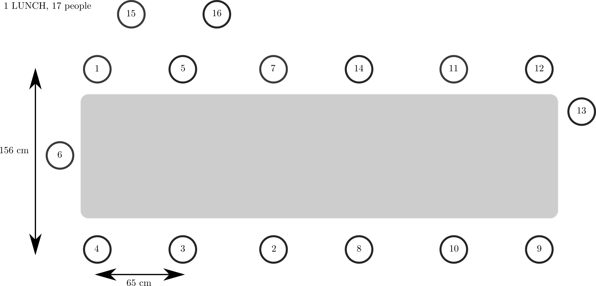
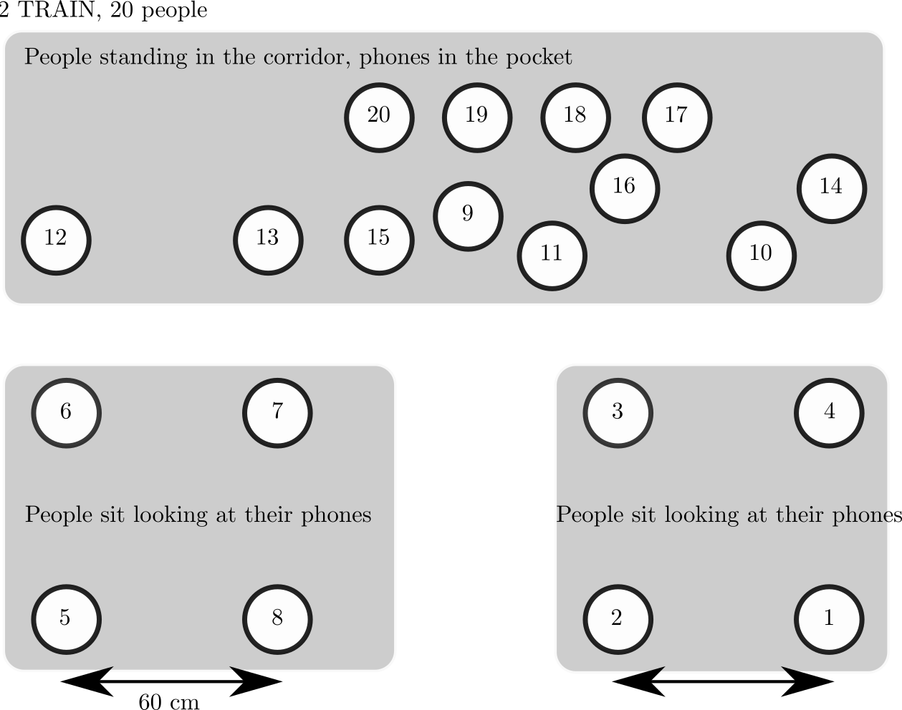
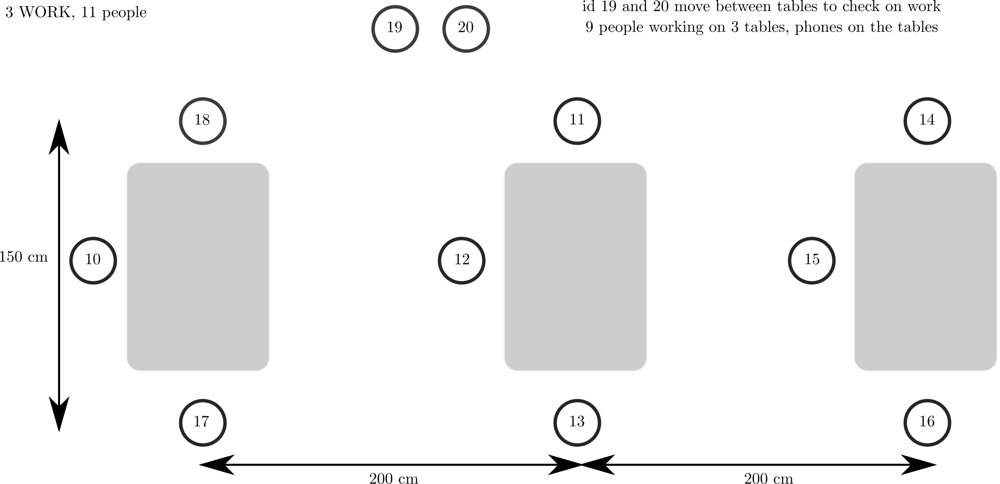
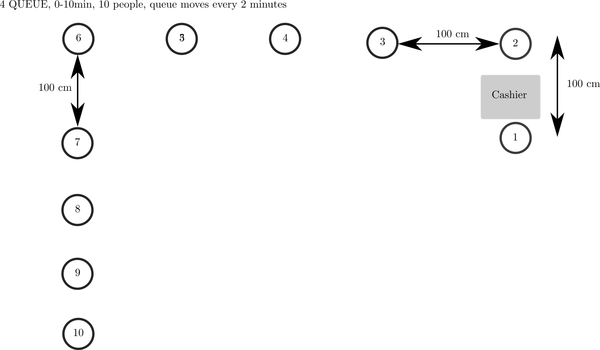
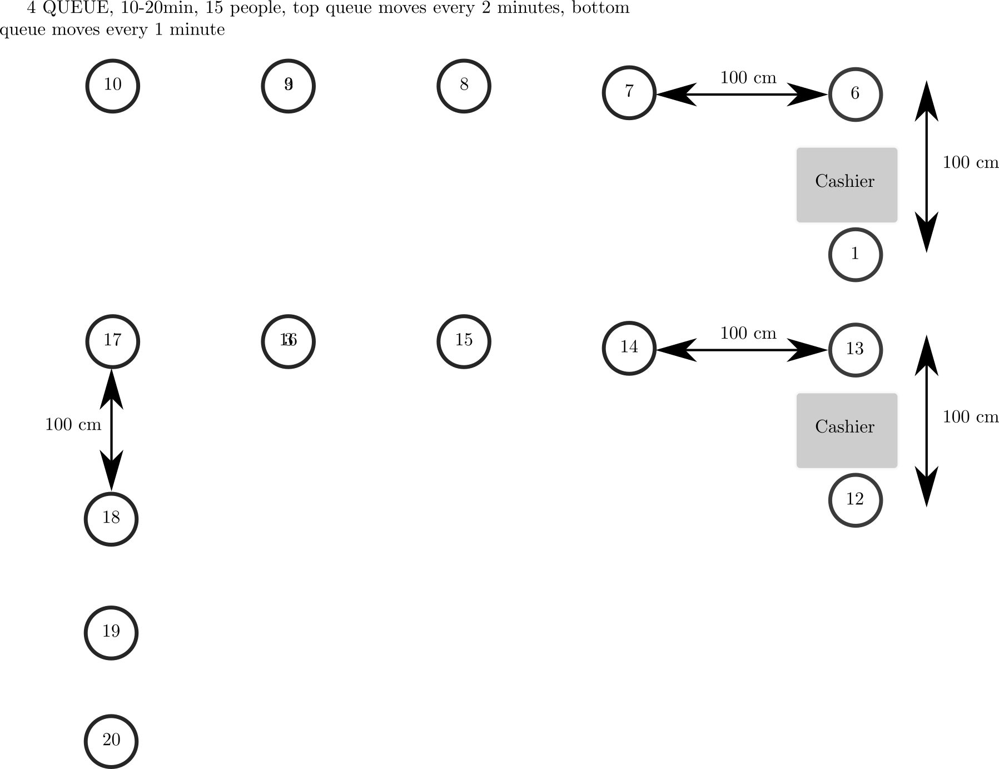
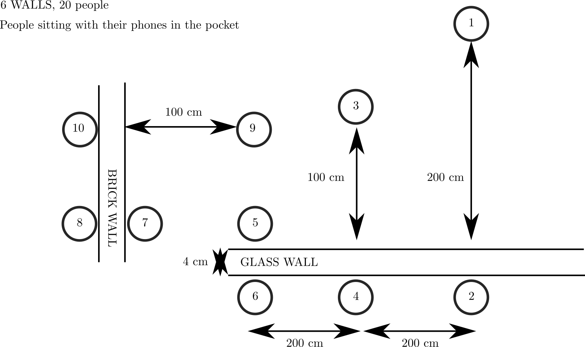

# Experiment 05: Soldiers in real life scenarios

The goal of these BLE distance/proximity experiments are to test real people
with phones in different scenarios.

The experiment was conducted on April 17, 2020.
Data for this experiment was collected using our own pre-GAEN application.

Note: the data in this experiment is superseded by experiment 34.


## Device names/soldiers (Soldier 1 is 1AliceSG10, etc. 20 soldiers):

* 1AliceGS10
* 2BobGS10
* 3CharlieGS10e
* 4DaveGS10e
* 5EmmaGA40
* 6HansGS20
* 7IvanGS10
* 8LeoGA90
* 9MegGS10
* 10NellyGA51
* 11OllyGS10
* 12PepGS10
* 13QueenGA40
* RobGA40 (no 14 prefix in the name)
* 15SamGA40
* 16TomGA40
* 17HugoGA40
* 18VeroGA40
* 19ZedGA40
* 20YanGA40
* 21WillyGA40 (not used in the experiments)
* 22JaneGA40 (not used in the experiments)


## Legend of Model Names:

* GS10 Galaxy S10
* GS10e Galaxy S10e
* GA40 Galaxy A40
* GA51 Galaxy A51
* GA90 Galaxy A90
* GS20 Galaxy S20
* GA90 Galaxy A90


## Other notes:

Soldiers were told to put their personal phones in airplane mode
6 cameras filmed the experiments
Experiments run from 07:00am to 11:30am
Timestamps in millisec UNIX time ( Android: System.currentTimeMillis())


## Pre-GAEN calibration Android app

The data in this experiment was collected using our internal pre-GAEN
calibration app. When we conducted this experiment, the Google/Apple Exposure
Notification API was not yet publicly available. Our calibration app was set to
transmit advertisements at ultra low power 4 times per second (we list the TX
powers of the different devices in the next section). This is similar
to the current GAEN API that advertises approximately at low power 4 times per
second.

When scanning for advertisements, we enabled high frequency background scanning,
allowing for 512ms every 5120ms while the app was running in background. To save
battery, we scanned for 20s every 60s (at the before mentioned interval). Our
scanning interval was therefore higher than the current GAEN scanning frequency
and our data therefore has more samples per minute.


Calibration app parameters:

* `TX_POWER_ULTRA_LOW`
* `ADV_MODE_BALANCED`
* `SCAN_MODE_LOW_POWER`


## Tx powers (Python list)

```.python
# NOTE: Alice is txpowers[1] dBm, etc.
txpowers = ['VOID',
	-20.0, -20.0, -20.0, -20.0, -21.0,
	-21.0, -20.0, -21.0, -20.0, -21.0,
	-20.0, -20.0, -21.0, -21.0, -21.0,
	-21.0, -21.0, -21.0, -21.0, -21.0,
]
```


## Scope and setting

For proximity tracing, we need to measure the distance between different phones. We have to anticipate a large amount of heterogeneity between any two phones:

* Different Bluetooth chips/capabilities (e.g., some phones only transmit at max power);
* Different locations (e.g., at ear, outside, on table, in front pocket, in back pocket, in backpack, in purse, in jacket);

The distance measurement must take into consideration all these different parameters. The experiments laid out here will create a set of baseline parameters for different phones to estimate distance together along with an error estimate.

We design two sets of experiments: first, laboratory experiments to infer baselines; second, social experiments to test the inferred baseline in a practical setting.

To assess the practicality of the laboratory experiments, i.e., how well they map into practice, we design a set of social experiments. For these social experiments, we will lay out a set of different “natural” scenarios of human interaction in which different subjects play their corresponding roles. The subjects are observed with cameras and act according to an experiment script.
Goal: test baseline measurements in real-world settings and assess precision

For each of the scenarios, we will assign some test subjects with varying phones to their roles. In addition, for each scenario, we have static and dynamic “canaries” who roam around. The canaries allow us to test if false contact events are recorded for specific phones/types (i.e., false positives). The canaries similarly send and receive beacons. Knowing the distance of the canaries and the strength of the sent/received beacons we can infer boundary conditions for safe distances. Each scenario starts with holding a phone with a full digital clock into the main camera.

The experiment was conducted in the EPFL BC atrium, a roughly 40m by 15m open
space inside a large office building. The ground truth evaluation was done using
a visual computing setup that mapped subjects to x/y coordinates on a grid
(several cameras at different floors filmed the experiments and visual
post-processing provided exact coordinates of the subjects during the
experiment).


## Scenario 1: lunch break (16 people)

Theme: colleagues sit at a table and “have lunch” for 30 minutes.

Script: Experiment starts with 16 people starting the tracking functionality of the app while standing in a waiting area. The first set of 7 people (ID1, …, ID7) moves to the table and sits. After 15:00 minutes the second set of 7 people (ID8, …, ID14) moves to the second table and sits. Phones are in people’s pockets. ID15 and ID16 (waiters) are randomly roaming around the tables throughout the experiment. 

List of interactions:

* At 7:30 min ID2 and ID5 take out their phones, put them on the table and turn the screens on
* At 9:30 min ID1 and ID4 go to the restroom and come back after 2 minutes
* At 19:30 min ID14 goes to the restroom and comes back after 2 minutes
* At 20:00 min ID11, ID9, ID13 take out their mobile from the pocket




## Scenario 2: public transport (20 people)

Theme: subjects ride a train together for 30 minutes.

Script: three sets of people, totaling 20 subjects. At the first stop 8 people enter the train and fill 2 compartments (sitting down). After 10min a second set of 8 people enter and fill the hallway (standing). At the next stop another 4 people enter the train (standing in the hallway as well) for a full 20 people. Every now and then, subjects take their phone out to check messages. This situation simulates an SBB 2nd class train compartment. 

List of interactions:
* At 7:30 min odd IDs (ID1, ID3, .., ) take their phones out of their pockets




## Scenario 3: work (11 people)

Theme: coworkers work together in an openspace setting for 30 minutes.

Script: a set of 9 subjects sit on 3 tables, 3 subjects per table, with 2m between tables. The subjects work on their computers and phones are on the desk. Two subjects move between tables and to check on work.




## Scenario 4: queuing in a store (20 people)

Theme: subjects wait in line at the supermarket for 20 minutes.

Script: the subjects form a line of 9 people, 1m apart, facing the same direction and a cashier at the front; they wait for 2 minutes until each person moves on; the queue gradually gets shorter. 
After 10 minutes, a second cashier opens a 2nd queue where 9 people wait 1 minute each.



After 10 minutes we add another queue (bottom)




## Scenario 5: inter-mingling (20 people)

Theme: bar or club

Script: 20 subjects are in a club/bar and intermingle, i.e., move around at regular intervals for 30 minutes (intermingling and walking around happens in 5min intervals). The phones are in their pockets.


## Scenario 6: in close proximity, but physically separated (10 people)

Theme: close but unaware

Script: two people are sitting close to each other but separated by a wall for 15 minutes.

Two types of walls, 3 distances: 0, 0.5, 1m; glass wall and concrete wall
Run experiment in parallel.
This is a stationary experiment, no camera needed



Note that the distance 7--5 is about 2m and 5--9 is about 3m.
