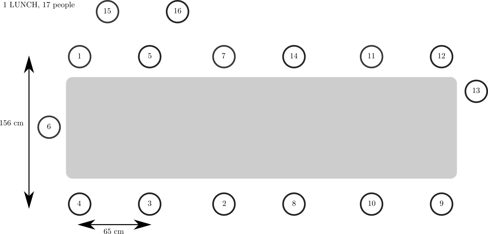
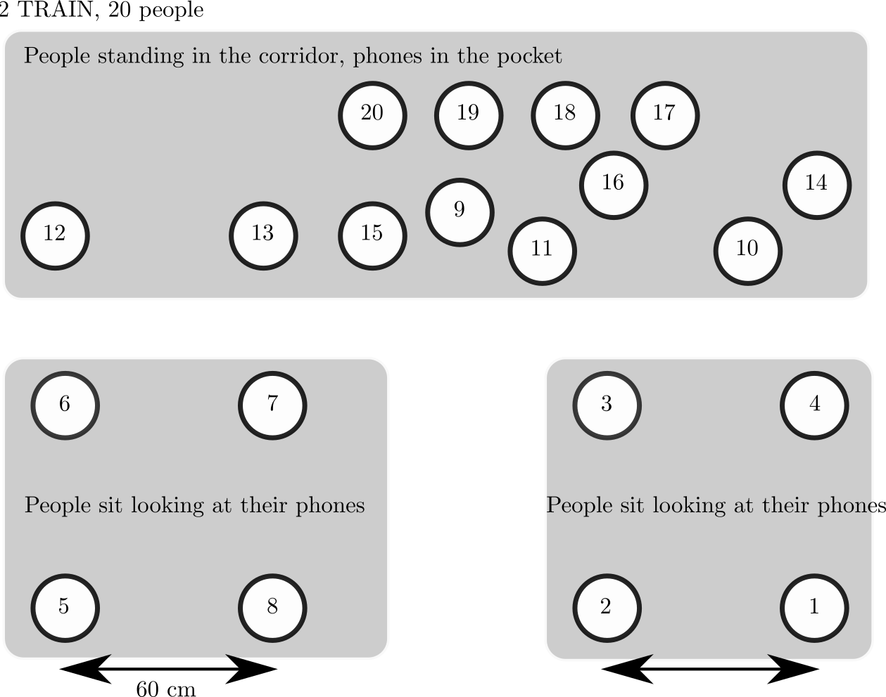
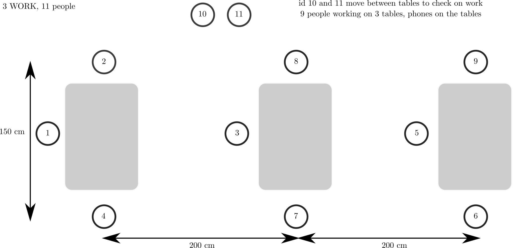
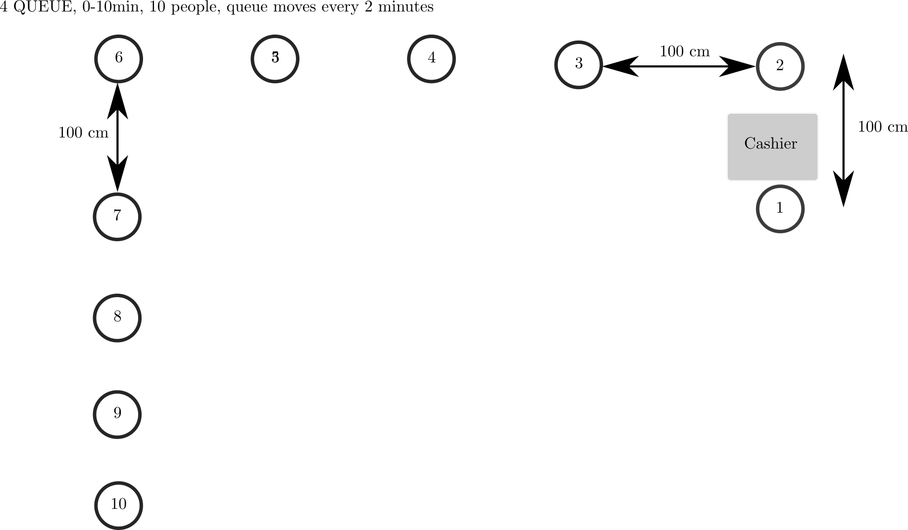
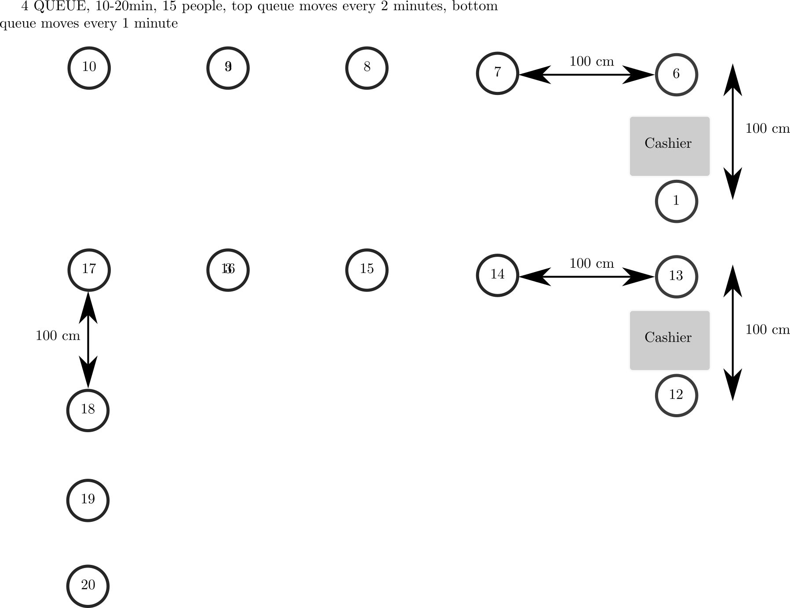

# README

Third round of experiments with soldiers at EPFL.
The goal of these BLE distance/proximity experiments are to test real people
with phones in different scenarios.

The experiment was conducted on July 30, 2020.

## Device names/soldiers (Soldier 1 is 1AliceSG10, etc. 20 soldiers):

A total of 20 soldiers took part in this experiment.

* 1AliceGS10
* 2BobGS10
* 3CharlieGS10e
* 4DaveGS10e
* 5EmmaGA40
* 6HansGS20
* 7IvanGS10
* 8LeoGA90
* 9MegGS10
* 10NellyGA51
* 11OllyGS10
* 12PepGS10
* 13QueenGA40
* RobGA40 (no 14 prefix in the name)
* 15SamGA40
* 16TomGA40
* 17HugoGA40
* 18VeroGA40
* 19ZedGA40
* 20YanGA40
* 21WillyGA40 (not used in the experiments)
* 22JaneGA40 (not used in the experiments)

## Legend of Model Names:

* GS10 Galaxy S10
* GS10e Galaxy S10e
* GA40 Galaxy A40
* GA51 Galaxy A51
* GA90 Galaxy A90
* GS20 Galaxy S20
* GA90 Galaxy A90

## Other notes:

Soldiers were told to put their personal phones in airplane mode
6 cameras filmed the experiments
Experiments run from 07:00am to 11:30am
Timestamps in millisec UNIX time ( Android: System.currentTimeMillis())

## Setup and devices

We used the current measurement app that is part of the DP-3T framework that
relies on the GAEN framework v1.2 to collect information.

* Android
    * Calibration app 0.3
    * GPS version 16*
* iOS
    * SwissCovid app version 1.0.8
    * iOS beta 13.6
* Several sniffers placed throughout the scene

We collected the data from the phones at the end of the experiment. For
Android devices, we triggered `adb bugreports`. For iPhones, we triggered
`iOS sysdiagnose` to collect all data. For the sniffers, we simply stored
the pcaps.

When collecting data from the iPhone we ran into an issue that Apple deployed
an update shortly before the experiment that "blinded" all GAEN data in the
packet logs. We could therefore not use the iPhone results from the experiment
as all recorded data was `0`ed.

The experiment was conducted in the EPFL BC atrium, a roughly 40m by 15m open
space inside a large office building. The ground truth evaluation was done using
a visual computing setup that mapped subjects to x/y coordinates on a grid
(several cameras at different floors filmed the experiments and visual
post-processing provided exact coordinates of the subjects during the
experiment).

* Duration: 4 hours (1 hour per scenario)
* Start: 2020-07-30 14:00
* End:   2020-07-30 18:00

## Scenario 1: lunch break (16 people)

Theme: colleagues sit at a table and “have lunch” for 30 minutes.

Script: Experiment starts with 16 people starting the tracking functionality of the app while standing in a waiting area. The first set of 7 people (ID1, …, ID7) moves to the table and sits. After 15:00 minutes the second set of 7 people (ID8, …, ID14) moves to the second table and sits. Phones are in people’s pockets. ID15 and ID16 (waiters) are randomly roaming around the tables throughout the experiment. 

## Scenario 2: public transport (20 people)

Theme: subjects ride a train together for 30 minutes.

Script: three sets of people, totaling 20 subjects. At the first stop 8 people enter the train and fill 2 compartments (sitting down). After 10min a second set of 8 people enter and fill the hallway (standing). At the next stop another 4 people enter the train (standing in the hallway as well) for a full 20 people. Every now and then, subjects take their phone out to check messages. This situation simulates an SBB 2nd class train compartment. 

## Scenario 3: work (11 people)

Theme: coworkers work together in an openspace setting for 30 minutes.

Script: a set of 9 subjects sit on 3 tables, 3 subjects per table, with 2m between tables. The subjects work on their computers and phones are on the desk. Two subjects move between tables and to check on work.

## Scenario 4: queuing in a store (20 people)

Theme: subjects wait in line at the supermarket for 20 minutes.

Script: the subjects form a line of 9 people, 1m apart, facing the same direction and a cashier at the front; they wait for 2 minutes until each person moves on; the queue gradually gets shorter. 
After 10 minutes, a second cashier opens a 2nd queue where 9 people wait 1 minute each.

After 10 minutes we add another queue (bottom)

## Scenario 5: inter-mingling (20 people)

Theme: bar or club

Script: 20 subjects are in a club/bar and intermingle, i.e., move around at
regular intervals for 30 minutes (intermingling and walking around happens in
5min intervals). The phones are in their pockets.

## Scenario 6: Gym class (20 people)

Theme: a shared gym class

Script: 20 subjects are in a highly mobile environment and run in circles,
amongst each other, and interact frequently and quickly. The scenario starts
off with subjects very close to each other and then gradually increasing the
free movement between subjects.
